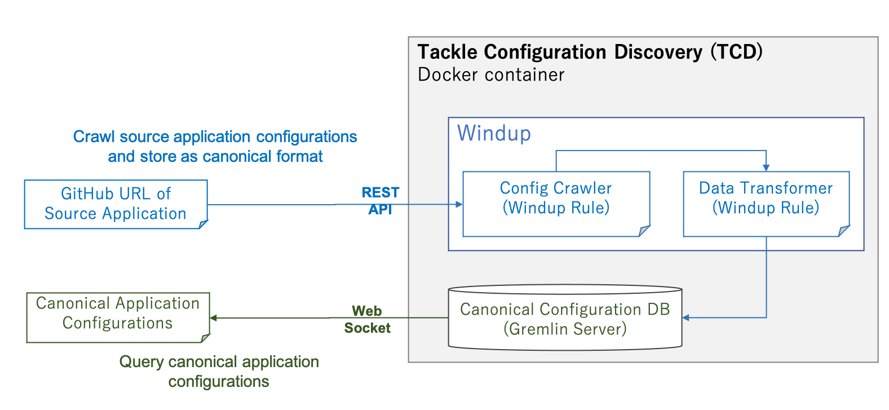
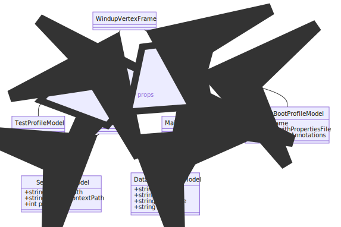

# Tackle Config Discover (TCD)

Tackle Config Discover (TCD) is the application configuration management server. It crawls application configurations from the codes and stores them as canonical format. Windup engine and Gremlin server are used for extracting application codes and managing canonical application configurations, respectively.

TCD provides two APIs.

- Crawl (REST API): ```GET http://<host_name>:<port_number>/collect?repo=<github_url>```
  - Download target application source codes from GitHub
  - Extract a set of application configuration data from the codes
  - Store configuration data as canonical format:
  
- Query (Web Socket): ```ws://<host_name>:<port_number>/gremlin```
  - Acqure a set of canonical application configuration data.



## Prerequisites
- Docker runnable environment (e.g. RHEL, Ubuntu, macOS)


## Getting Started

1. Execute the following command for build docker images and launching the server.
```
$ docker-compose up -d
```

2. Get access to the server from TCD client: `tackle-configuration-discover-cli`.

## Data model in canonical configuration DB


